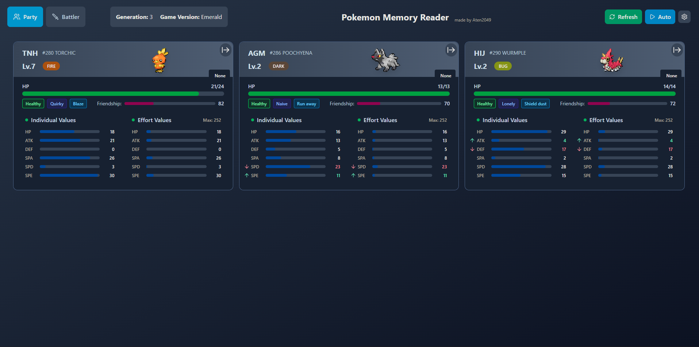

# Pokemon Memory Reader

A BizHawk Lua script that reads live game data from Pokemon ROMs, providing real-time access to party information, stats, and more without needing to save and exit the game.

> [!IMPORTANT]
> This repository is ONLY the code for the reader, and does not include a frontend site to view the data. If you would like to view the frontend application, please take a look at the **Frontend** portion of this readme.

## Features

- **Live Data Reading**: Access Pokemon party data in real-time while playing
- **Multi-Generation Support**: Works with Gen 1-3 Pokemon games
- **HTTP API**: Built-in REST API server for external tool integration
- **Comprehensive Data**: Full stats including IVs, EVs, moves, abilities, and more

#### Future Features
- **Battle Tracker**: The ability to track battle information live like the opposing pokemon, their moves, pp, etc. 

## Supported Games

### Generation 1
- Pokemon Red
- Pokemon Blue  
- Pokemon Green
- Pokemon Yellow

### Generation 2
- Pokemon Gold
- Pokemon Silver
- Pokemon Crystal

### Generation 3
- Pokemon Ruby (v1.0, v1.1, v1.2)
- Pokemon Sapphire (v1.0, v1.1, v1.2)
- Pokemon Emerald
- Pokemon FireRed
- Pokemon LeafGreen

### Romhacks
- Radical Red

## Installation

1. Download and install [BizHawk](https://github.com/TASVideos/BizHawk/releases)
2. Grab the latest [release](https://github.com/NathanTBeene/pokemon-memory-reader/releases).
3. Load a supported Pokemon ROM in BizHawk
4. Open the Lua Console in BizHawk (Tools → Lua Console)
5. Load `main.lua` in the Lua Console

## Usage

### Basic Commands

After loading the script, you can use these commands in the Lua Console:

```lua
-- Show current party information
showParty()

-- Show available commands
help()
```

### HTTP API Server

The script includes a built-in HTTP server that provides JSON data:

> [!NOTE]
> The server will start automatically when you launch the lua script and will restart when you change games, so for the most part these commands won't need to be used.

```lua
-- Start the API server (runs on localhost:8080 by default)
startServer()

-- Stop the API server
stopServer()

-- Toggle server on/off
toggleServer()
```

#### API Endpoints

When the server is running, you can access:

- `GET http://localhost:8080/party` - Get party data in JSON format
- `GET http://localhost:8080/status` - Get server and game status
- `GET http://localhost:8080/` - Get API documentation

### Front End
For those who are looking for a front end application to use this server, I have a [gitpages](https://nathantbeene.github.io/pokemon-memory-viewer/) open that has my current implementation of the frontend.



##### Features
- Initial Party tracker.
- Changes info based on generation.
- Export to **showdown** button.
- Gets generation-specific sprites.
- Auto-refresh option.

##### Unimplemented
- Battle information.

## Architecture

The project is organized into several modules:

- **`main.lua`**: Main script entry point and command interface
- **`core/`**: Core functionality (game detection, memory reading)
- **`readers/`**: Generation-specific party readers
- **`data/`**: Game data constants and character mappings
- **`utils/`**: Utility functions (config loading, game utilities)
- **`network/`**: HTTP server implementation
- **`debug/`**: Debugging tools and utilities

## Requirements

- BizHawk emulator (latest stable version recommended)
- Supported Pokemon ROM file
- LuaSocket (included in modules directory)

## API Integration

The HTTP API returns JSON data that can be integrated with external tools.

#### Party Data Fields

The `/party` endpoint returns an array of Pokemon objects. Each Pokemon object contains:

| Field | Type | Description | Example |
|-------|------|-------------|---------|
| `nickname` | string | Pokemon's nickname (falls back to species name if no nickname) | "Bulby" |
| `species` | string | Pokemon species name | "Bulbasaur" |
| `speciesId` | number | Pokemon species ID (Internal Pokedex number) | 1 |
| `level` | number | Pokemon's current level (1-100) | 5 |
| `nature` | string | Pokemon's nature name (affects stat growth) | "Hardy" |
| `currentHP` | number | Current hit points | 45 |
| `maxHP` | number | Maximum hit points | 45 |
| `IVs` | object | Individual Values for each stat (0-31) | `{"hp": 31, "attack": 31, ...}` |
| `EVs` | object | Effort Values for each stat (0-252) | `{"hp": 0, "attack": 0, ...}` |
| `moves` | array | Array of move IDs ([Source](https://bulbapedia.bulbagarden.net/wiki/List_of_moves)) | `[33, 45, 73, 22]` |
| `moveNames` | array | Array of move Names based on ID | `["Tackle", "Growl"]` |
| `heldItem` | string | Name of held item. "None" for a blank item. | "Rindo Berry" |
| `heldItemId` | number | Numerical ID of held item. ([Source](https://bulbapedia.bulbagarden.net/wiki/List_of_items)) | 187 |
| `status` | string | Current status condition | "Normal", "Sleep", "Poison", etc. |
| `friendship` | number | Friendship/happiness value (0-255) | 70 |
| `abilityIndex` | number | Which ability slot the Pokemon has (0 or 1) | 0 |
| `abilityId` | number | The numerical ID of the ability. List can be found [here](https://bulbapedia.bulbagarden.net/wiki/Ability). | 65 (Overgrow) |
| `ability` | string | Pokemon's ability name | "Overgrow" |
| `hiddenPower` | string | Hidden Power type based on IVs | "Psychic" |
| `isShiny` | boolean | Whether the Pokemon is shiny | false |
| `types` | array | Pokemon's types (1 or 2 strings) | `["Grass", "Poison"]` or `["Fire"]` |

### Status Endpoint Fields

The `/status` endpoint returns server and game information:

| Field | Type | Description | Example |
|-------|------|-------------|---------|
| `server.running` | boolean | Whether the server is currently running | true |
| `server.port` | number | Port number the server is listening on | 8080 |
| `server.host` | string | Host address the server is bound to | "localhost" |
| `server.type` | string | Type of server | "HTTP Server" |
| `game.initialized` | boolean | Whether a Pokemon game has been detected | true |
| `game.name` | string | Name of the detected Pokemon game | "Pokemon Ruby" |
| `game.generation` | number | Pokemon game generation (1, 2, or 3) | 3 |
| `game.version` | string | Specific version/color of the game | "Ruby" |

## License

This project is licensed under the **GNU General Public License v3.0 with Creative Commons Non-Commercial ShareAlike terms**.

**Key License Terms:**
- **BY (Attribution)**: You must give appropriate credit and indicate if changes were made
- **NC (Non-Commercial)**: You may not use this work for commercial purposes
- **SA (ShareAlike)**: If you remix, transform, or build upon this material, you must distribute your contributions under the same license

This ensures the project remains free and open source while preventing commercial exploitation. Any derivatives must also be non-commercial and use this same license.

**Note:** This project is for educational and research purposes. Please respect the intellectual property rights of Pokemon and related franchises.